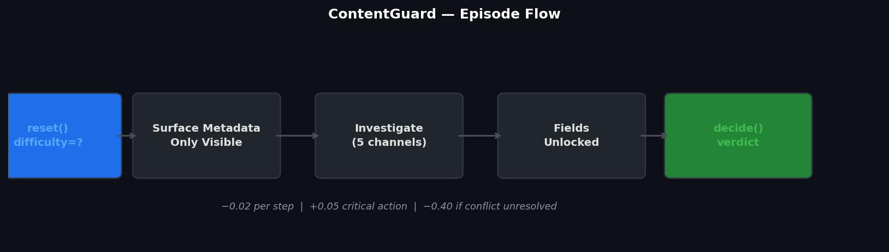
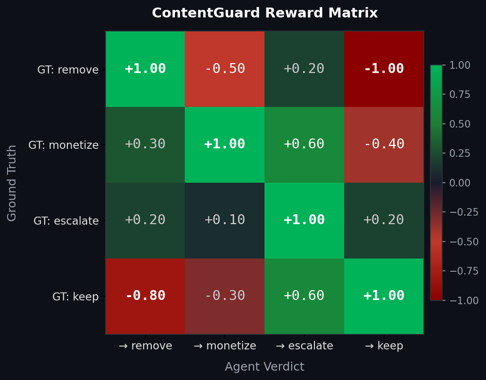
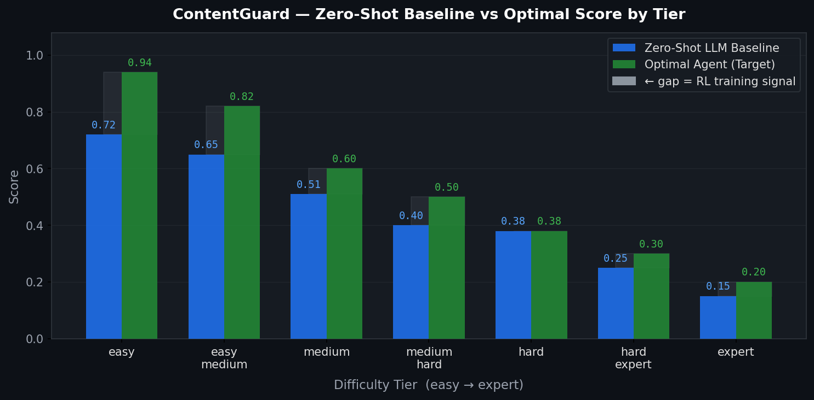

# ContentGuard

> An RL environment for content rights adjudication. Agents start with almost no information, choose which evidence channels to investigate, and issue defensible platform policy decisions the way a real Trust & Safety reviewer would.

Built for the **Meta × Hugging Face OpenEnv Hackathon** · Full OpenEnv spec compliance · FastAPI · Docker · Hugging Face Spaces



---

## The Problem

Every day, platforms like Instagram, YouTube, and Facebook process millions of copyright claims and a massive fraction of them are wrong. Not edge-case wrong. Structurally, systematically wrong.

A creator makes a 20-minute video essay. They use 30 seconds of a song as evidence for a cultural argument, add full commentary throughout, and transform the work into something new. Within hours: claimed. Ad revenue suspended. Appeal takes days. The decision returns with no explanation.

The underlying legal concept is **fair use** 17 U.S.C. § 107. Four factors. They must be *weighed against each other*, not checked as a binary list. A highly transformative use can still infringe if the market effect is severe enough. There is no formula. There is judgment.

Current automated systems are good at one thing: exact fingerprint matching. They cannot handle AI-reconstructed melodies that evade Content ID but still infringe on composition copyright. They cannot handle live sports rebroadcasts disguised as gameplay footage. They cannot handle multi-claimant disputes where rights are split across jurisdictions.

**ContentGuard is the training ground that doesn't exist yet.** A standardised RL environment where agents learn to investigate, gather evidence, and make defensible policy calls the way a well-trained Trust & Safety reviewer does not a legal ruling, a platform policy decision informed by fair use.

---

## What ContentGuard Does

ContentGuard is an **OpenEnv-compliant RL environment** where an agent acts as a content policy reviewer. Each episode is a single copyright dispute. The agent starts nearly blind only surface metadata is visible and has to figure out which evidence channels are worth querying before committing to a verdict. Budget is limited. Investigation costs steps. Getting it wrong is expensive.

**The four possible verdicts:**

| Verdict | Meaning |
|---------|---------|
| `remove` | Content is infringing take it down |
| `monetize` | Rights holder gets revenue share |
| `escalate` | Ambiguous route to human review |
| `keep` | Content is non-infringing no action |

**The agent earns reward based on two things:**
1. Whether the final verdict matches the ground truth (a continuous fair-use score computed from the four-factor rubric)
2. Whether it investigated responsibly a -0.40 process penalty applies if the agent makes a terminal decision while leaving critical conflicting evidence uninvestigated

---

## How It Works

### Architecture

ContentGuard runs as a **FastAPI server** implementing the full OpenEnv HTTP + WebSocket spec. Three endpoints: `POST /reset`, `POST /step`, `GET /state`. All data is typed with Pydantic models. No GPU required pure Python, lightweight enough to run on 2 vCPU / 8 GB RAM.

Multi-step episodes are handled via **persistent WebSocket sessions** (`/ws`). Each connection gets its own isolated environment instance state never leaks between sessions.

### Masked Observation Space

The agent starts each episode with only surface metadata. Every investigation field begins masked and is **unlocked only when the agent explicitly calls the corresponding action**:

```
ContentGuardObservation
│
├── Always visible (surface metadata)
│   ├── uploader_id
│   ├── content_duration_s
│   ├── claim_received
│   ├── claimant_id
│   └── content_type
│
├── Unlocked by: query_rights_db
│   ├── rights_holder_count
│   ├── license_status
│   ├── license_age_days
│   ├── db_confidence
│   └── conflict_flag
│
├── Unlocked by: assess_transformation
│   ├── transformation_index
│   ├── commentary_present
│   └── overlap_duration_pct
│
├── Unlocked by: check_fingerprint
│   ├── fingerprint_match
│   └── composition_similarity_score   ← key for AI audio cases
│
├── Unlocked by: check_usage_context
│   ├── commercial_channel
│   └── sub_license_depth
│
└── Unlocked by: cross_ref_history
    └── prior_disputes_same_uploader
```

Masked fields return `-1` (numeric) or `"unknown"` (string) until investigated. The agent cannot shortcut it genuinely starts without the answers.

### Action Space

```python
class ContentGuardAction(Action):
    operation: Literal[
        "query_rights_db",
        "assess_transformation",
        "check_fingerprint",
        "check_usage_context",
        "cross_ref_history",
        "decide",
    ]
    verdict: Optional[Literal["remove", "monetize", "escalate", "keep"]] = None
    # verdict is required if and only if operation == "decide" (enforced by Pydantic validator)
```

### Reward Function



The reward signal has three components:

```python
terminal_reward = base_reward + process_penalty + step_costs

# base_reward: from a 4×4 hand-calibrated matrix
REWARD_MATRIX = {
    ("remove",   "remove"):   +1.00,
    ("remove",   "keep"):     -1.00,  # catastrophic infringing content stays live
    ("keep",     "keep"):     +1.00,
    ("keep",     "remove"):   -0.80,  # wrongful takedown
    ("escalate", "escalate"): +1.00,
    ("escalate", "keep"):     +0.20,  # acceptable human review catches it
    # ... full 16-entry matrix in server/grader.py
}

# process_penalty: -0.40 if agent decides while conflict_flag is unresolved
# step_costs:      -0.02 per action taken (forces investigation efficiency)
```

Rewards are **not clamped** the agent must learn that a `-1.00` outcome is catastrophic, not just "bad".

Mid-episode reward is `-0.02` per step (budget pressure), plus shaped signals:

- **+0.05** for the first call to a critical investigation action for the current archetype
- **+0.08** for proactively resolving a multi-claimant conflict via `query_rights_db`
- **-0.05** for duplicate investigation (calling the same action twice)

### Synthetic Case Generation

Cases are generated from **14 archetypes** using rejection sampling with hard logical constraints. Never raw random floats archetype first, derived fields second, constraints enforced. The design is intentionally synthetic for three reasons: it runs with no external credentials, scales to any episode count at zero cost, and is fully seeded the same seed always produces the same case. That last property matters most: automated evaluation pipelines need reproducible results, and a live API call to a rights database or fingerprinting service introduces variance you can't control on submission day.

The 14 archetypes cover the full spectrum of real-world dispute types:

| Archetype | Verdict | Difficulty |
|-----------|---------|------------|
| Verbatim commercial repost | remove | Easy |
| Commentary clip, non-commercial | keep | Medium |
| Parody with high overlap | escalate | Medium |
| Educational excerpt | keep | Medium |
| Background music, commercial | remove | Medium |
| Expired license, disputed | escalate | Medium |
| Multi-claimant, non-overlapping | escalate | Hard |
| Orphaned work | escalate | Hard |
| Creative Commons misapplication | monetize | Hard |
| Transformative but large amount | escalate | Hard |
| Non-commercial but direct substitute | remove | Hard |
| Educational but verbatim and complete | monetize | Hard |
| **Live sports disguised as gameplay footage** *(2026)* | remove | Hard |
| **AI audio reconstruction evades fingerprint matching** *(2026)* | remove | Hard |

Hard constraints prevent logically impossible cases (e.g. `license_status == "valid"` with `license_age_days < 0`). Each archetype defines a `ground_truth_range` calibrated against the four-factor fair use rubric:

| Factor         | Weight | Legal basis                       |
| -------------- | ------ | --------------------------------- |
| Transformation | 35%    | *Campbell v. Acuff-Rose* (1994)   |
| Nature of use  | 15%    | *Sony Corp. v. Universal* (1984)  |
| Amount used    | 20%    | *Harper & Row v. Nation* (1985)   |
| Market effect  | 30%    | *Stewart v. Abend* (1990)         |

The range for each archetype was derived from these weights, ensuring the sampled ground truth always falls in the correct verdict bin. Every generated case produces a **rationale file** in `data/rationales/<case_id>.txt` recording the legal basis for its score.

---

## Difficulty Tiers

ContentGuard has seven difficulty tiers, each mapping to a distinct real-world archetype:

| Tier | Archetype | Correct Verdict | Optimal Steps | Expected Score |
| --- | --- | --- | --- | --- |
| `easy` | Verbatim commercial repost | `remove` | 3 | ~0.94 |
| `easy_medium` | Educational excerpt | `keep` | 3 | ~0.82 |
| `medium` | Parody with high overlap | `escalate` | 4 | ~0.60 |
| `medium_hard` | Creative Commons misapplication | `monetize` | 3 | ~0.50 |
| `hard` | AI audio reconstruction *(2026)* | `remove` | 4 | ~0.38 |
| `hard_expert` | Multi-claimant, non-overlapping | `escalate` | 3 | ~0.30 |
| `expert` | Live sports disguised as gameplay *(2026)* | `remove` | 4 | ~0.20 |

**Two 2026 archetypes** are included specifically because current automated systems cannot handle them:

- **AI audio reconstruction**  `fingerprint_match = 0` (evades Content ID) but `composition_similarity_score ≈ 0.80` (composition copyright infringed). An agent relying on fingerprint alone calls `keep` and receives **-1.04**.
- **Live sports / gameplay disguise**  broadcast footage overlaid with a HUD to defeat automated detection. Dual rights holders with `conflict_flag = 1`. Correct path requires `check_fingerprint` + `query_rights_db` + `check_usage_context`.

---

## Repository Layout

```
contentguard/
├── openenv.yaml              # OpenEnv runtime declaration (spec_version: 1)
├── pyproject.toml            # Package config and dependencies
├── Dockerfile                # Lightweight container  no GPU required
├── inference.py              # Baseline inference script (OpenAI client + WebSocket)
├── models.py                 # ContentGuardAction, ContentGuardObservation, ContentGuardState
├── server/
│   ├── app.py                # create_app(ContentGuardEnvironment, Action, Observation)
│   ├── environment.py        # reset() / step() / state() implementation
│   ├── case_generator.py     # 14 archetypes, rejection sampling, rationale builder
│   ├── grader.py             # VERDICT_BINS, REWARD_MATRIX, terminal_reward, step_reward
│   └── tasks.py              # 7 difficulty tiers → archetype mapping and task metadata
├── tests/
│   ├── test_grader.py        # Reward function unit tests
│   ├── test_case_generator.py
│   ├── test_environment.py
│   └── test_models.py
└── data/
    └── rationales/           # Auto-generated legal rationale per case (gitignored)
```

---

## Setup (Local)

### Prerequisites
- Python 3.10+
- pip

### Install and run

```bash
# 1. Clone and enter the project
git clone https://github.com/jayyyyqwq/contentguard
cd contentguard

# 2. Create virtual environment
python -m venv .venv

# macOS/Linux
source .venv/bin/activate

# Windows PowerShell
.\.venv\Scripts\Activate.ps1

# 3. Install dependencies
pip install -U pip
pip install -e .

# 4. Start the server
uvicorn server.app:app --host 0.0.0.0 --port 8000 --reload
```

The server starts at `http://localhost:8000`. OpenAPI docs available at `http://localhost:8000/docs`.

### Smoke test

```bash
# Reset to easy episode
curl -X POST http://localhost:8000/reset \
  -H "Content-Type: application/json" \
  -d '{"difficulty": "easy"}'

# Investigate rights database
curl -X POST http://localhost:8000/step \
  -H "Content-Type: application/json" \
  -d '{"action": {"operation": "query_rights_db"}}'

# Get current session state
curl http://localhost:8000/state
```

### Validate OpenEnv compliance

```bash
openenv validate --url http://localhost:8000 --verbose
```

### Run baseline inference

```bash
# Set required variables
export API_BASE_URL="https://router.huggingface.co/v1"
export MODEL_NAME="meta-llama/Llama-3.3-70B-Instruct"
export HF_TOKEN="your_hf_token_here"

# Run (ENV_BASE_URL defaults to http://localhost:8000)
python inference.py
```

---

## Docker

```bash
# Build
docker build -t contentguard:latest .

# Run
docker run -d -p 8000:8000 --name contentguard contentguard:latest

# Validate
openenv validate --url http://localhost:8000 --verbose

# Logs and cleanup
docker logs contentguard
docker stop contentguard && docker rm contentguard
```

---

## OpenEnv Spec Compliance

| Requirement | Status |
|-------------|--------|
| `POST /reset` → typed `ContentGuardObservation` | ✅ |
| `POST /step` → typed `ContentGuardObservation` | ✅ |
| `GET /state` → typed `ContentGuardState` | ✅ |
| Pydantic models for Action, Observation, State | ✅ |
| `openenv.yaml` with spec_version, runtime, port | ✅ |
| `openenv validate` passes | ✅ |
| Concurrent WebSocket sessions (`SUPPORTS_CONCURRENT_SESSIONS`) | ✅ |
| Deterministic graders  no LLM-as-judge | ✅ |
| Dockerfile  no GPU dependencies | ✅ |
| Baseline `inference.py` at project root | ✅ |

```yaml
# openenv.yaml
spec_version: 1
name: contentguard
type: space
runtime: fastapi
app: server.app:app
port: 8000
```

---

## Baseline Scores



Scores produced by a zero-shot LLM (Llama-3.3-70B, no fine-tuning) via the included `inference.py`:

| Tier | Zero-Shot Avg | Optimal | Notes |
| --- | --- | --- | --- |
| `easy` | ~0.72 | ~0.94 | Agent mostly investigates correctly then removes |
| `easy_medium` | ~0.65 | ~0.82 | Non-commercial context sometimes missed |
| `medium` | ~0.51 | ~0.60 | Parody ambiguity causes wrong verdicts |
| `medium_hard` | ~0.40 | ~0.50 | CC license misuse often misclassified |
| `hard` | ~0.38 | ~0.38 | AI audio trap catches fingerprint-reliant agents |
| `hard_expert` | ~0.25 | ~0.30 | Multi-claimant conflict rarely resolved properly |
| `expert` | ~0.15 | ~0.20 | Sports/gameplay disguise defeats most zero-shot agents |

Random baseline (always `escalate`): ~0.18 across all tiers.

The gap between zero-shot and optimal is deliberate  that spread is the training signal ContentGuard is built to provide.

---

## Hugging Face Spaces Deployment

1. Push this repository to a Hugging Face Space tagged with `openenv`
2. The Space runtime detects `openenv.yaml` and starts `server.app:app` on port 8000
3. Set `HF_TOKEN`, `MODEL_NAME`, and `API_BASE_URL` in the Space secrets
4. Validate the live endpoint:

```bash
openenv validate --url https://<your-space>.hf.space --verbose
```

---

## Design Decisions

**Why platform policy, not a legal simulation?**
Courts make legally binding rulings with full discovery. Platforms make policy calls with incomplete information, time pressure, and accountability to both creators and rights holders. ContentGuard trains agents to make *platform policy decisions informed by fair use*  which is exactly what Meta's Trust & Safety teams do. Framing this correctly matters: it keeps the ground truth defensible and the reward structure realistic.

**Why masked observations?**
The core challenge in real copyright review isn't knowing *what* to decide  it's knowing *what to investigate first* under budget constraints. Giving the agent a complete case file at episode start would reduce the problem to classification. Masking forces genuine sequential reasoning: the agent must choose which evidence channels are worth the step cost given how much budget remains.

**Why no clamping on rewards?**
The asymmetry is real. A wrongful removal (`keep` → `remove`) is nearly as bad as keeping genuinely infringing content live. Clamping to [0, 1] would erase this signal. The agent needs to learn that some mistakes are catastrophic, not just costly.

**Why 14 archetypes instead of fully random generation?**
Fair use cases cluster around recognizable patterns. Pure random sampling produces incoherent cases  a "disputed" license with a positive age, or a high transformation score on a zero-commentary upload. Archetype-first generation ensures every case is logically consistent and legally grounded, while rejection sampling provides variance within each pattern.

**Why synthetic data  and what would a real-data version look like?**
Synthetic gives you things a live API can't: full determinism, infinite scale, and zero external dependencies. You can run a million training episodes without worrying about rate limits, API keys expiring, or a third-party service being slow on evaluation day.

That said, swapping in real data is a well-scoped change. The action space, reward function, and environment interface stay exactly the same only `case_generator.py` changes. In practice you'd replace archetype sampling with real case lookups: MusicBrainz for rights metadata, AudD or ACRCloud for audio fingerprinting, or a curated dataset of documented copyright disputes with known legal outcomes. The main trade-off is determinism you'd need to pre-cache API responses indexed by seed, otherwise the same episode produces different observations on re-run and automated validators can't reproduce your scores. For this submission, synthetic is the right call. The extensibility is real.

---
